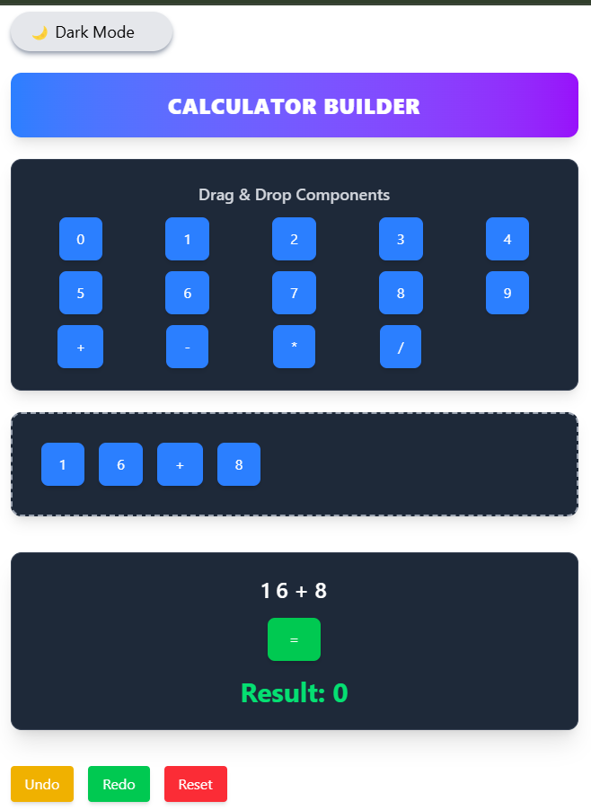
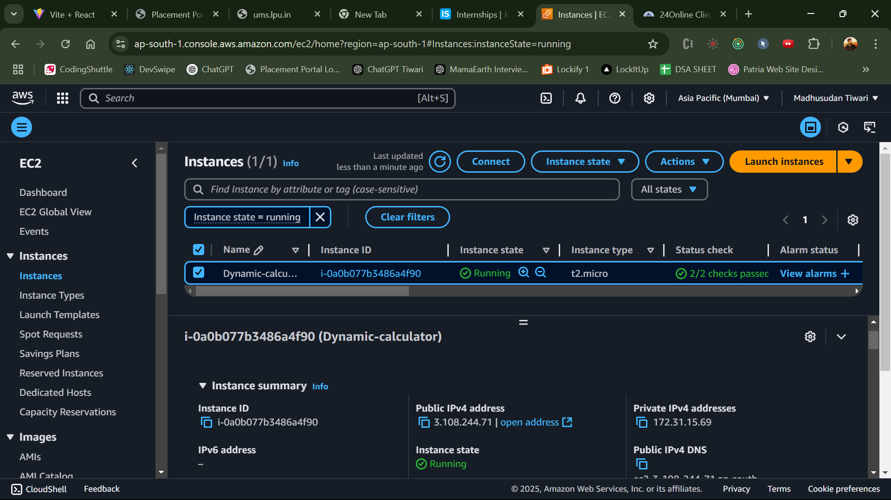
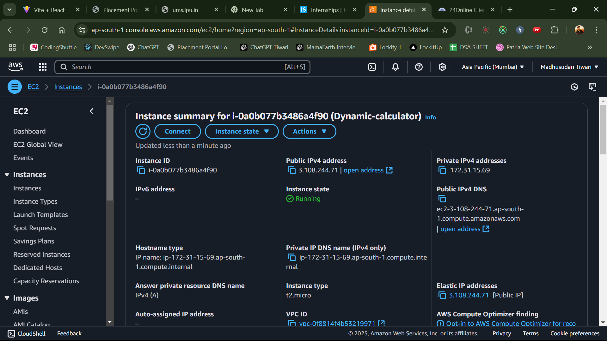
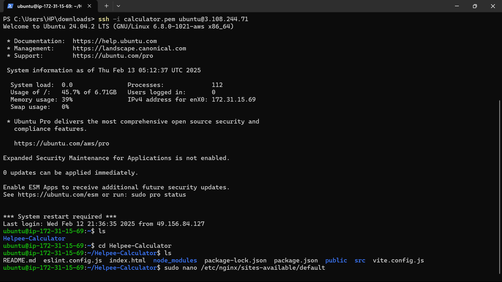

Here's a **README.md** file with clear installation and deployment instructions for your project:  

---

### 🧮 Helpee Calculator - Drag & Drop Calculator Builder  

This project allows users to **dynamically create, arrange, and use a calculator** with **drag-and-drop** functionality. Built with **React, Zustand, and DnD-Kit**, it supports **dark mode**, **undo/redo**, and **persistent layout storage**.  

---

## 🚀 Features  

✅ **Drag & Drop Components** – Move buttons freely.  
✅ **Predefined Components** – Supports numbers (0-9) and operations (+, -, *, /).  
✅ **Custom Layout** – Arrange buttons in any order.  
✅ **Real-time Calculation** – Instantly evaluates expressions.  
✅ **State Management with Zustand** – Efficient and fast updates.  
✅ **Dark Mode** – Toggle between light and dark themes.  
✅ **Local Storage Persistence** – Saves calculator layout automatically.  
✅ **Undo/Redo** – Restore previous states easily.  

---

## 📦 Installation  

### 1️⃣ Clone the Repository  
```bash
git clone https://github.com/your-username/Helpee-Calculator.git
cd Helpee-Calculator
```

### 2️⃣ Install Dependencies  
```bash
npm install
```

### 3️⃣ Start the Development Server  
```bash
npm run dev
```
Now, open **http://localhost:5173/** in your browser. 🎉  

---


## 🛠 Built With  

- **React** – UI Framework  
- **Zustand** – State Management  
- **DnD-Kit** – Drag & Drop  
- **Tailwind CSS** – Styling  
- **Vite** – Build Tool  

---

## 🤝 Contributing  

1. **Fork** the repository.  
2. **Create a branch** (`git checkout -b feature-name`).  
3. **Commit changes** (`git commit -m "Added new feature"`).  
4. **Push** the branch (`git push origin feature-name`).  
5. Open a **Pull Request**.  

---

## 📜 License  

This project is **open-source** and available under the **MIT License**.  

---
Now, save this file as `README.md` in your project root. 🚀
